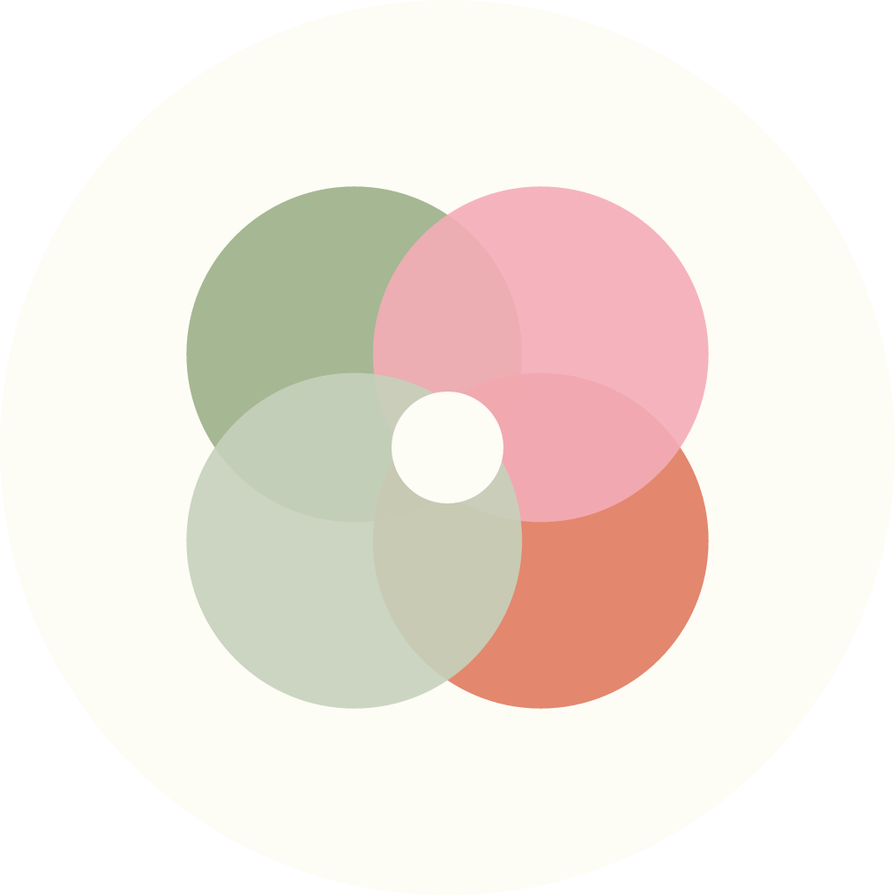

<p align="center">
  
</p>

<h1 align="center">Poop Tracker</h1>

<p align="center">
  A personal, offline-first gut health tracker built with Flutter.
</p>

<p align="center">
  
  
  
  
  
</p>

---

## Overview

Poop Tracker is a private health journaling app that helps users track their gut health comfortably and consistently. The app is fully offline — no accounts, no cloud sync, and no data collection. All journal entries are stored locally on the device as a CSV file, giving users complete ownership of their data.

The interface is designed to feel calm and approachable, using a warm sage-green and terracotta palette with rounded typography.

---

## Features

| Feature | Description |
|---|---|
| **Daily Journal Entries** | Log bowel movement type, discomfort level (1–10), quick tags, estimated calories, and personal notes |
| **Calendar History** | Browse and review past entries on a full interactive monthly calendar |
| **Weekly Rhythm Tracker** | Visual progress indicator showing how many days in the past week the user has logged |
| **Daily Reminders** | Configurable daily push notification with a user-selected time |
| **Offline-First Storage** | All data is written to a local CSV file — nothing is transmitted off the device |
| **CSV Export** | Share or back up journal data at any time via the native Android share sheet |
| **Profile Customization** | Set a personal nickname and choose an emoji avatar |
| **Onboarding Flow** | Friendly 4-step onboarding for first-time setup |

---

## Project Structure

```
lib/
├── core/
│   └── theme/
│       └── app_theme.dart              # Central color palette and ThemeData
├── data/
│   ├── models/
│   │   └── journal_entry.dart          # JournalEntry model and CSV serialization
│   └── services/
│       ├── csv_service.dart            # Read, write, and delete entries from local CSV
│       └── notification_service.dart   # Daily reminder scheduling (timezone-aware)
└── features/
    ├── home/
    │   └── home_screen.dart            # Dashboard with weekly rhythm card
    ├── history/
    │   └── history_screen.dart         # Calendar view and entry list with swipe-to-delete
    ├── journal/
    │   └── new_entry_screen.dart       # New entry form
    ├── onboarding/
    │   └── onboarding_screen.dart      # First-launch onboarding flow
    └── settings/
        ├── settings_screen.dart        # Notification preferences and data export
        └── edit_profile_screen.dart    # Avatar and nickname editor
```

---

## Tech Stack

| Layer | Package |
|---|---|
| Framework | Flutter 3.x / Dart 3.x |
| Local Storage | [`csv`](https://pub.dev/packages/csv) + [`path_provider`](https://pub.dev/packages/path_provider) |
| Notifications | [`flutter_local_notifications`](https://pub.dev/packages/flutter_local_notifications) + [`flutter_timezone`](https://pub.dev/packages/flutter_timezone) |
| Preferences | [`shared_preferences`](https://pub.dev/packages/shared_preferences) |
| Calendar UI | [`table_calendar`](https://pub.dev/packages/table_calendar) |
| Data Export | [`share_plus`](https://pub.dev/packages/share_plus) |

---

## Getting Started

### Prerequisites

- Flutter SDK `>=3.0.0`
- Android Studio or VS Code with the Flutter/Dart extensions
- A connected Android device or emulator

### Installation

```bash
# Clone the repository
git clone https://github.com/pak-pow/PoopTracker.git
cd PoopTracker

# Install dependencies
flutter pub get

# Run on a connected device
flutter run
```

> This project primarily targets Android. The iOS and desktop scaffolding is present but untested.

---

## Design System

The app uses a consistent design language across all screens:

| Token | Value | Usage |
|---|---|---|
| Background | `#FDFCF5` | Page and card backgrounds |
| Text | `#3A3A3A` | All body and heading text |
| Sage Green | `#A3B18A` | Primary actions, section labels, active states |
| Terracotta | `#E29578` | CTAs, streak indicators, selected states |
| Blush | `#FFDAB9` | "Loose & Watery" type indicator |

**Font:** Nunito

---

## Privacy

Privacy is a core design constraint, not an afterthought:

- No internet permission required
- No user accounts or authentication
- No analytics, telemetry, or crash reporting
- All data is stored in a single CSV file on the user's device
- Users can export or delete their data at any time

---

## Screenshots

> Coming soon.

---

## Author

Developed by **pak-pow**

---

## License

This project is private. All rights reserved.
